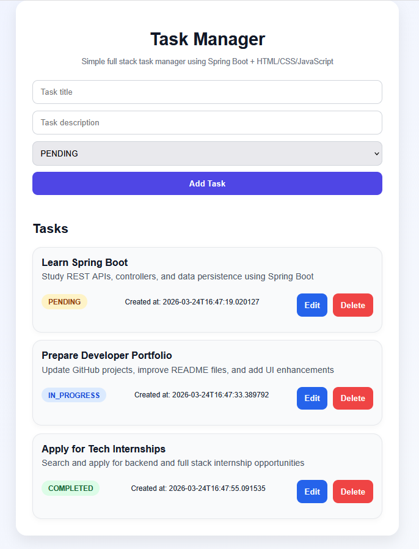

# ✅ Task Manager API

REST API for task management built with Java, Spring Boot, and Spring Data JPA.

This project includes a simple frontend interface to interact with the API, making it a full stack application.

- Backend development with Java and Spring Boot
- RESTful API design
- Integration between frontend and backend

> 💡 Projeto desenvolvido com foco em aprendizado de desenvolvimento backend com Java, Spring Boot e boas práticas de APIs REST.

---

## 🎨 Frontend

This project also includes a simple frontend built with HTML, CSS, and JavaScript to interact with the API.

### Features:
- Create tasks
- Edit tasks
- Delete tasks
- View tasks with status badges
- Clean and modern UI

📍 Frontend location:
/frontend/index.html

---

## 🚀 Features

* Create, read, update and delete tasks (CRUD)
* Get task by ID
* In-memory database using H2
* Interactive API documentation with Swagger (OpenAPI)

---

## 🛠 Tech Stack

### Frontend
- HTML5
- CSS3
- JavaScript (Vanilla)

### Backend
- Java 17
- Spring Boot
- Spring Web
- Spring Data JPA

### Database
- H2 Database (in-memory)

### Tools
- Maven
- Swagger (OpenAPI)

---

## 📄 API Documentation

Swagger UI available at:

http://localhost:8080/swagger-ui/index.html

---

## 📁 Project Structure

```
src/main/java/com/isabella/taskmanager
├── controller
│   └── TaskController.java
├── model
│   └── Task.java
├── repository
│   └── TaskRepository.java
└── TaskmanagerApplication.java
```

---

## ▶️ How to Run

### 🔧 Backend

1. Clone the repository:

```bash
git clone https://github.com/SEU-USUARIO/task-manager-api.git
```

2. Navigate to the project folder:

```bash
cd task-manager-api
```

3. Run the application:

```bash
./mvnw spring-boot:run
```

📍 The API will be available at:
http://localhost:8080/tasks

📍 Swagger documentation:
http://localhost:8080/swagger-ui/index.html

---

### 🎨 Frontend

1. Go to the frontend folder:

```bash
cd frontend
```

2. Open the file:

```bash
index.html
```

👉 You can also use **Live Server** in VS Code for a better experience.

---

💡 Make sure the backend is running before opening the frontend.


---

## 📸 Screenshots

### Task Manager UI



---

## 📌 Example Request (POST)

```
{
  "title": "Study Spring Boot",
  "description": "Learning enums",
  "status": "PENDING"
}
```

---

## 👩‍💻 Author

**Isabella Portela** 🚀
Backend Developer in training
